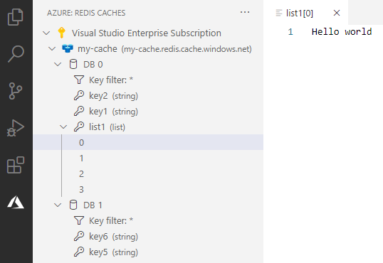
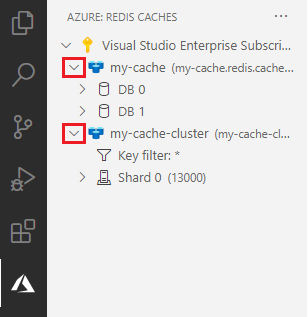
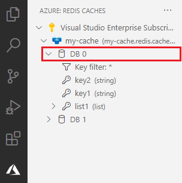
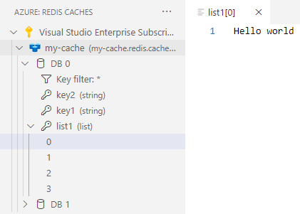

# Azure Cache for Visual Studio Code (Preview)

 

Azure Cache for Redis is a fully managed, open source–compatible in-memory data store to power fast, scalable applications. Use this extension to view the data in your Azure Caches and monitor them at a glance.

> Sign up today for your free Azure account and receive 12 months of free popular services, $200 free credit and 25+ always free services 👉 [Start Free](https://azure.microsoft.com/free/open-source).

## Features

* View data in your Azure Caches across all your Azure subscriptions
    * Supports clustered and non-clustered caches
    * Supports all Redis data types
* Filter Redis keys by match expression
* View cache properties
* Access primary key and connection string

## Installation

1. Download and install the [Azure Cache extension](https://marketplace.visualstudio.com/items?itemName=ms-azurecache.vscode-azurecache) for Visual Studio Code
2. Once installed, you'll see an Azure icon in the Activity Bar
    > If your activity bar is hidden, you won't be able to access the extension. Show the Activity Bar by clicking View > Appearance > Show Activity Bar
3. Sign in to your Azure Account by clicking **Sign in to Azure...**
    > You may already be signed in if currently use other Azure extensions.

    > If you don't already have an Azure Account, click **Create a Free Azure Account...** for a free account with $200 in Azure credits to try out any combination of services for 30 days.

### View cache data
1. Expand the subscription tree item to reveal the caches belonging to it.

    
2. Expand a cache item to connect to it and see all the DBs with data in them. For a clustered cache, you will see shards instead.

    

3. Expand a DB/shard to reveal all the Redis keys under it.

    

4. Click on a Redis key name to open its contents in a new editor tab.

    

    > For collection type Redis keys, clicking on it will reveal the individual elements in it. Clicking the individual element will display its contents.

    > For string type Redis keys, clicking on it directly reveals the contents in a new tab.

### View cache properties
1. Expand the subscription tree item to reveal the caches belonging to it.

2. Click on a cache item to see its properties.

    

## Contributing

There are several ways you can contribute to our [repo](https://github.com/microsoft/vscode-azurecache):

* **Ideas, feature requests and bugs**: We are open to all ideas and we want to get rid of bugs! Use the [Issues](https://github.com/microsoft/vscode-azurecache/issues) section to report a new issue, provide your ideas or contribute to existing threads.
* **Documentation**: Found a typo or strangely worded sentences? Submit a PR!
* **Code**: Contribute bug fixes, features or design changes. See [the wiki](https://github.com/microsoft/vscode-azurecache/wiki/Contributing-code) for instructions.

## Known Issues

* Connections to clustered caches do not use SSL due to an [ioredis issue](https://github.com/luin/ioredis/issues/1149).
    * (Connections to non-clustered caches always use SSL.)

## Legal

When you submit a pull request, a CLA-bot will automatically determine whether you need to provide a CLA and decorate the PR appropriately (e.g., label, comment). Simply follow the instructions provided by the bot. You will only need to do this once across all repositories using our CLA.

## Code of Conduct

This project has adopted the [Microsoft Open Source Code of Conduct](https://opensource.microsoft.com/codeofconduct/). For more information see the [Code of Conduct FAQ](https://opensource.microsoft.com/codeofconduct/faq/) or contact [opencode@microsoft.com](mailto:opencode@microsoft.com) with any additional questions or comments.

## Trademarks

This project may contain trademarks or logos for projects, products, or services. Authorized use of Microsoft trademarks or logos is subject to and must follow [Microsoft's Trademark & Brand Guidelines](https://www.microsoft.com/en-us/legal/intellectualproperty/trademarks/usage/general). Use of Microsoft trademarks or logos in modified versions of this project must not cause confusion or imply Microsoft sponsorship. Any use of third-party trademarks or logos are subject to those third-party's policies.

## License

The source code in our [public repository](https://github.com/microsoft/vscode-azurecache) is licensed under the [MIT license](https://github.com/microsoft/vscode-azurecache/blob/main/LICENSE.txt) and may be locally built and used in accordance with this license.
